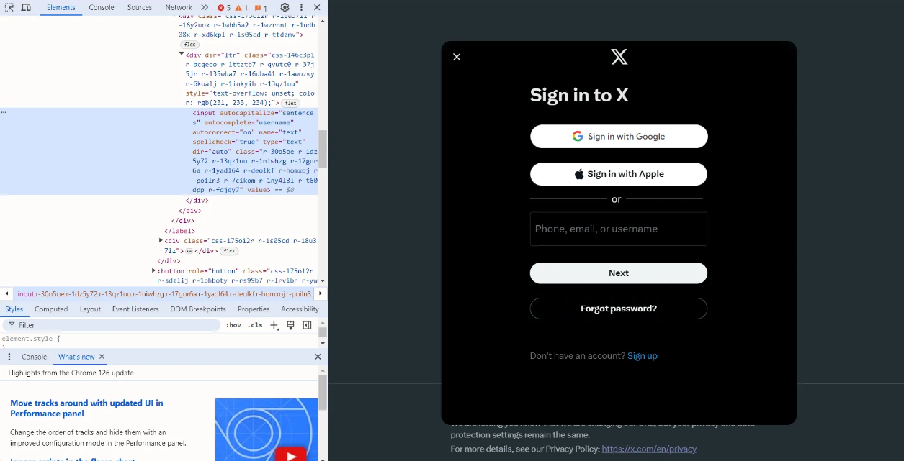
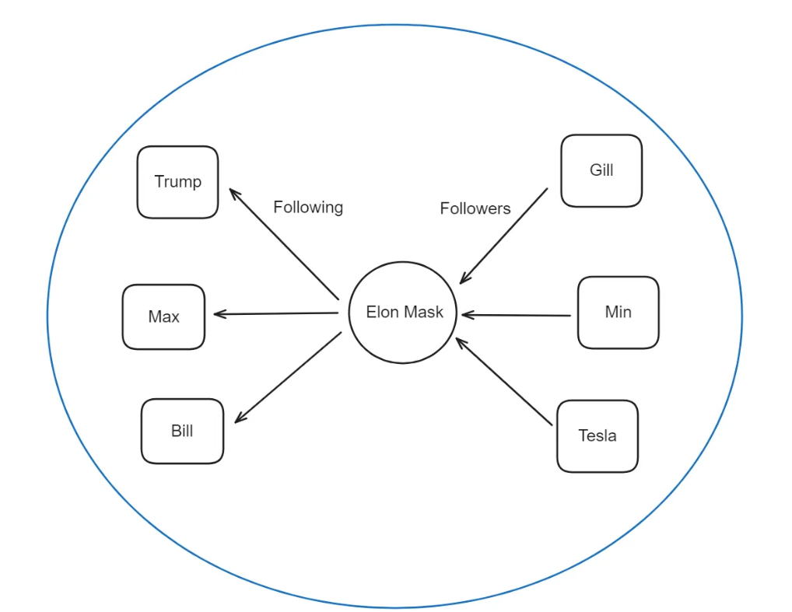

## How we can use Web Crawling and Social Network Analysis (SNA) to analyze Twitter Connections

In the past, I had been curious as to how people interact with each other and the different forms of connections made between them, especially in online spaces. This came in different forms from platforms like X (formerly Twitter), Instagram, Linkedin, and many more; these platforms share different purposes but ultimately all have the ability to find how people connect to other individuals, whether through followers or another method of detection. This project is centered around that interest, where I use a web crawler to scrape data off of X, and analyze it using SNA. SNA is a method used to examine the relationships between individuals within a network, revealing how they interact and influence each other. On social media platforms like X, SNA can uncover key figures and connections within a community. In this project, I used Elon Musk as the central figure to analyze his network of connections, aiming to understand his reach, influence, and connections within the platform.



I used Python for this project, which I will explain in a second, but here are the libraries within which I used also. I will go into further detail throughout this blog on the areas in which they were used.

> BeautifulSoup4: A Python library used to parse HTML and extract data from web pages. It allowed us to extract profile data for each user in the network.

> Selenium: An automation tool that enabled us to navigate the platform dynamically, handling interactions that BeautifulSoup4 alone couldn’t manage (e.g., scrolling to load more connections).

> NetworkX: A Python library used to construct and analyze the network graph, enabling us to calculate centrality metrics and visualize the network structure.

> Matplotlib: A plotting library that helped in creating clear and informative visualizations of the network.

> Plotly: A plotting library as well, providing interactions and a more aesthetic colour schema.

> Sqlalchemy: A lightweight database library handling data collection automation.

## Goals and how they were achieved

### 1. Scrape data from the X web page using a web crawling automated bot

The first step I had to take was to create the automated bot that would be gathering data and storing it in a database for me to use. It was created in Python with the use of multiple libraries alongside it. 

Python was chosen for the project as I had previous experience with using it for data visualizations, and it contains different libraries for machine learning and data visualization that have been highly developed. Additionally, it was picked for its relatively straightforward syntax compared to other languages such as R and its abundance of useful, optimized libraries - even if the language itself isn’t highly performant. 

### Create a visualization of Elon Musk's social network on X using aforementioned data

After data collection, the next step was to construct my social network. This was done using the NetworkX library in python, and using it I was able to transform the raw data which I had into meaningful results which I could interpret. It also was used to create visualizations of the social network, and had features to calculate centrality metrics which can measure the degree of closeness between individuals, which individuals have the most connections, as well as others.

## Step-by-step of the project

The first step to take for the project is to import all the necessary libraries and download the chrome driver. The chrome driver enables automatic web apps to be ran on chrome, which is necessary for our project.

```python
# Path to ChromeDriver
CHROMEDRIVER_PATH = r'path to local chrome driver'
# User credentials
USER_USERNAME = 'name of bot'
USER_PASSWORD = 'password for bot'
USER_EMAIL = 'email for bot'
# Target URL
URL_ID = "scrapingdog"
TARGET_URL = f"https://twitter.com/{URL_ID}"
# Initialize the Chrome WebDriver
driver = webdriver.Chrome(service=Service(CHROMEDRIVER_PATH))
# Open the target URL
driver.get(TARGET_URL)
driver.implicitly_wait(5)
```

There is other code associated with inputting the correct credentials to login to the bot X account, and involves using mechanisms of waiting so that it is hopefully not detected as an automated machine. However, with more frequent logins happening X may try to protect their website from bots like our web crawler, and direct you to a different page asking for the email to be reentered to prevent this. I circumnavigated this by trying to have the bot run the default code, but if the password field is not found on the page then it will recognize that and use the protocol for logging in on the alternative login page. 

After the auto-login process was set up, I then focused on getting the web crawler to actually scrape the user data off of their twitter profiles. To do this the page source must first be retrieved and parsed using BeautifulSoup. After this, we can begin the info extracction. This begins with a center point, which I chose to be Elon Musk's profile on X as he has a wide range of connections to people from all sectors—and is a public profile. The web crawler first collected data such as his username, handle, biography, header, follower count, and following count to save them in a temporary Python dictionary before being transferred to the database. 

This process will output a Python dictionary that looks like this.

```python
{'Profile Name': 'Scrapingdog', 
'Profile Handle': '@scrapingdog', 
'Profile Bio': 'Scrapingdog provides web scraping tools, APIs & extension for fast & seamless data extraction', 
'Profile Header': 'Science & Technologyscrapingdog.comJoined April 2020', 
'Profile Follower': '148 Followers', 
'Profile Following': '48 Following'}
```

Now that we have gotten the data collection working and tested it on our center node (Elon Musk), we can begin forming his social network through analyzing his connections. This starts with collecting a list of his direct connections, which are first-degree connections in SNA, and scraping their individual data from their profiles. 

The action of jumping to the next page of his followers is done by this following code.

```python
time.sleep(1)
######################## Go to Following Page ##########################
# Find the followers link and click it
followers_href = f"/{URL_ID}/following"  # Update this with the correct href value
followers_link = WebDriverWait(driver, 10).until(
    EC.presence_of_element_located((By.XPATH, f"//a[@href='{followers_href}']"))
)
followers_link.click()
```

This sends the web crawler to Elon Musk's followers page, where then it begins the process of retrieving the profile information of all followers which are displayed on his page (usually well-known accounts with a limit on how many are displayed, as he is Elon Musk and has hundreds of millions of followers, which would obviously take too long to collect data on).

The function below reaches out to all of the "leaves," which are the individuals in his followers list, and scrapes their information to store using Pandas. 

```python
import pandas as pd
# Extract each follower account element
account_elements = driver.find_elements(By.CSS_SELECTOR, "#react-root > div > div > div.css-175oi2r.r-1f2l425.r-13qz1uu.r-417010.r-18u37iz > main > div > div > div > div > div > section > div:nth-child(2) > div > div")

# Extract information for each account
followers_info = {'Name':[], 'Handle':[], 'Bios':[]}

def extract_leaf_texts(element):
    if element.name is None:  # It's a NavigableString (leaf text node)
        return [element]
    
    texts = []
    for child in element.children:
        texts.extend(extract_leaf_texts(child))
    return texts

for account_element in account_elements:

    account_html = account_element.get_attribute('outerHTML')
    soup_account = BeautifulSoup(account_html, 'html.parser')
    
    account_info = {}

    text = extract_leaf_texts(soup_account)

    # print(text)
    if text:
        followers_info['Name'].append(text[0])
        followers_info['Handle'].append(text[1])
        if len(text)>4:
            t = ''
            for i in text[4:]:
                t+=i
            followers_info['Bios'].append(t)
        else:
            followers_info['Bios'].append(None)

pd.DataFrame(followers_info)
```

This process is then replicated for his verified followers and following lists as well using similar code. 

Now that we have all of this data, we need to create a database to store it in. This is where Sqlalchemy comes in. We can use it to create a database that we can write and read information from.

```python
import sqlalchemy

# Connect to the database
engine = sqlalchemy.create_engine('sqlite:///x.db')
conn = engine.connect() 

# Write the DataFrame to the database
df_followers.to_sql(name='follower', con=conn, if_exists='replace', index=False)
df_following.to_sql(name='following', con=conn, if_exists='replace', index=False)
df_v_followers.to_sql(name='v_follower', con=conn, if_exists='replace', index=False)
```

At this point this is what our data for Elon Musk's social network looks like on a condensed scale.



After collecting all of this data on Elon Musk's first-degree connections, I then moved on to scraping the data from his second-degree and third-degree connections as well. In other words, I went to the users we collected in his followers, verified followers, and following lists, and went into their profiles to find their followers, verified followers, and followings and toko the data of those individuals as well. Repeating this 2 more times allows us to form a larger web of Elon Musk's social network.

<!-- 

1. Numquam fugiat quibusdam aut ut
2. Soluta necessitatibus deserunt nobis
3. Illum esse recusandae facere ipsam

Lorem ipsum dolor sit amet consectetur adipisicing elit. Unde reprehenderit inventore sunt, consequatur omnis tempore ullam natus, porro odit aut, atque asperiores repudiandae corporis quidem esse eos provident velit perferendis magni fugit eum quisquam eligendi. Atque distinctio iure aliquam veniam inventore, soluta est, cum accusantium possimus illum quasi eveniet sed amet ipsa culpa vel in delectus laboriosam repellendus totam. Facere.

## Suscipit soluta necessitatibus deserunt nobi

Minus rem dicta eos exercitationem illum consequatur consectetur praesentium voluptas. Dolor inventore quasi necessitatibus odio eaque doloribus.


Numquam fugiat quibusdam aut ut, voluptatibus accusamus repellendus quas minus consequuntur possimus! -->
