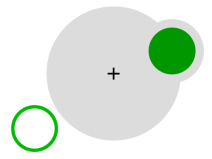
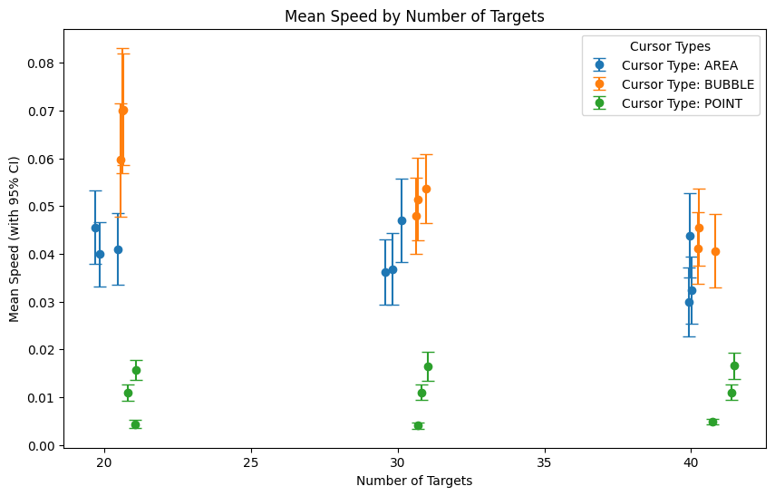
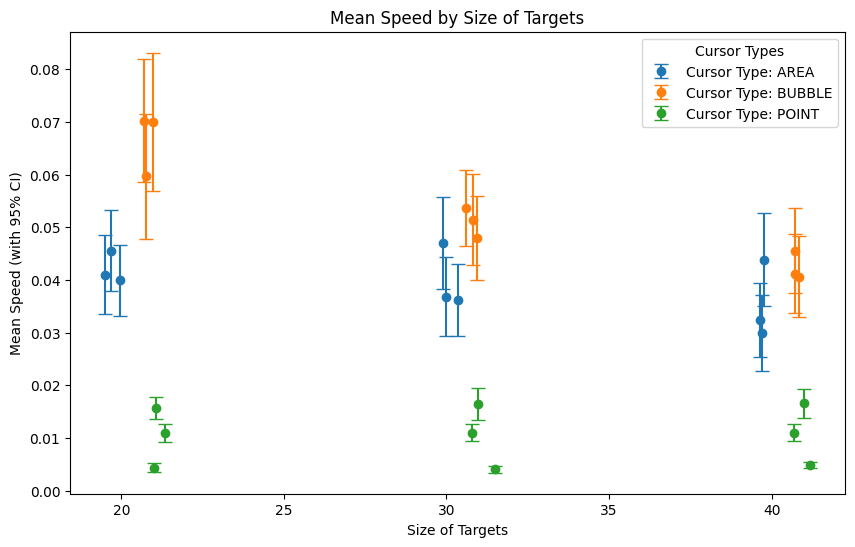

## What is a "Bubble Cursor"?

Cursors are commonly recognized today as the moving pointer on a screen that you can use to select areas and click buttons. The way these work is by moving your cursor to be placed on top of the area you wish to interact with, and then clicking to complete the interaction. However, what if we made a cursor that would adapt its activation area by resizing itself? This is what the button cursor is for: a cursor which dynamically resizes its activation area depending on the proximity of its surrounding targets, ensuring that only one target is selectable at any time. This is not a new concept and research was done upon it back in 2005, but I wanted to explore it as a way of improving my undersatnding of a well-designed and scientifically sound experiment. 

A video can be found here with further details on how this technology works and is implemented. [Bubble Cursor](https://www.youtube.com/watch?v=JUBXkD_8ZeQ) 

All credits go to the original creators Tovi Grossman and Ravin Balakrishnan.

## Takeaways from this Study

### Experimental Procedures

By conducting this study, I was able to gain a better understanding of the practical applications of techniques in experiment design such as control and treatment groups, and how these are implemented to achieve greater accuracy and success. I ran my epxeriment using 3 types of cursors, the point, area, and bubble cursors; 3 different sizes of targets to click; and 3 amounts of targets that would have to be clicked on. I repeated these with a few participants, which were limited as there were no benefits I could provide to them by helping me complete this study. 

### Different Analyses

I learned how to analyze areas of data through calculations for precision, accuracy, recall, and others. Additionally, I now better understand how biases play a role in influencing these results, and how we can best minimize the bias involved, one way of which is to have participants fill out a survey detailing the study and their rights and requirements beforehand. 

> Example Consent Form
- Introduction: What the research is about and who is conducting it.
- Purpose: Why the research is being conducted.
- Procedures: What participants will be asked to do.
- Voluntary Participation: The participant’s right to withdraw from the study at any time.
- Confidentiality: How the participant’s information will be kept private and used only for the research.
- Contact Information: Who to contact for more information or in case of concerns.

### Some graphs and analysis

By conducting this study, I was able to create some graphs to draw some conclusions from my study. As we can see here, the bubble and area cursors generally performed better in our simple tests compared to the standard point cursor. 

Overall, while this study was not anywhere near perfect and we cannot draw any concrete conclusions, it was interesting for me to run and see how such a study is done and helped me to learn about these processes.